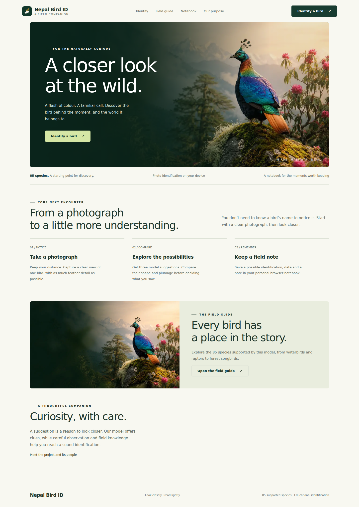
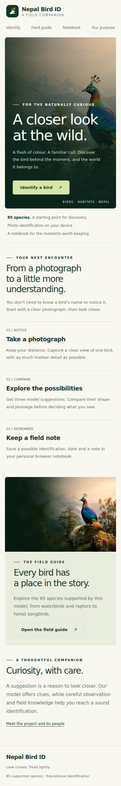

# Nepal Bird ID — Web

A static, mobile-friendly field companion that runs the existing EfficientNetB0 model in the browser. No Python server is required after conversion.

## Run locally

Use Node.js 22 or 24:

```bash
cd web
npm ci
npm run dev
```

Open the URL printed by Vite. To verify the production build:

```bash
npm run build
npm run preview
```

## Deploy to Cloudflare Pages

1. Connect this GitHub repository to Cloudflare Pages.
2. Select the branch containing the web app (merge the pull request first to deploy `main`).
3. Set **Root directory** to `web`.
4. Set **Build command** to `npm run build`.
5. Set **Build output directory** to `dist` (relative to `web`).
6. Deploy, then open the generated `pages.dev` URL and test a photo upload.
7. In the Pages project's **Custom domains**, add your purchased domain and follow Cloudflare's DNS instructions.

The committed model is ready to serve. No model conversion, Python installation, API keys or database setup is needed in Cloudflare's build.

After your final domain is known, replace the relative `og:image` value in `index.html` with its absolute HTTPS URL. Route names are hash-based for this first release; individual species are not separate indexed pages yet.

## Features

- On-device photo identification with the original 85-class model and exact class-index mapping.
- JPG, PNG and WebP upload; mobile capture; optional centre crop.
- Lazy model download, progress indicator, retryable failures and tensor cleanup.
- Pillow-compatible antialiased bilinear resizing; raw 0–255 RGB input, with normalization retained in the model graph.
- Top-three suggestions, attributed Wikimedia reference images and sourced Wikipedia introductions.
- Searchable taxonomy guide with historical conservation fields clearly identified.
- Browser-local field notes, deletion and JSON export; no account or shared observation database.
- Contributor portraits and responsible observation guidance from the existing project.

## Verification

```bash
npm run verify:model
npx playwright install chromium
npm run verify:browser
npm run build
npm run verify:release
```

The CPU and browser WebGL graph were compared against Python predictions for three reference inputs. Maximum observed absolute score difference was under 0.000001; all three rankings matched. The existing hero illustration also passed the full upload flow after preserving Python resizing. This is conversion evidence, **not a real-world accuracy evaluation**.

The production build also passed a failed-download/retry check and a crop/rerun check. All five views were checked at a 390px viewport, including species search, opening profiles, saving a note, and persistence after reload. Physical Android/iPhone performance and camera permissions still need field testing. External Wikimedia/Wikipedia requests have fallbacks; their availability and selected reference photos need review on the deployed site.

## Model and data scope

- Approximately 21 MiB of float32 inference weights, in six shards of up to 4 MiB each. First-use network cost is substantial; subsequent browser HTTP caching helps but can be evicted.
- The classifier always returns supported classes, even for non-birds or unsupported species. Scores are not calibrated probabilities. No rejection model has been added.
- Species metadata reproduces project materials through 2022. A dash is not a Least Concern assessment.
- The existing hero artwork is editorial imagery, not a verified species reference.
- The original Streamlit app and Python model remain available at the repository root. Its optional Grad-CAM view has no browser counterpart in this release.
- Notes are unverified and stored only in this browser; clearing site data removes them. Photos are not stored in the notebook.
- The published model can be downloaded by visitors.

See [CONVERSION.md](CONVERSION.md) for reproducible export details, and the repository's [SOURCES.md](../SOURCES.md) for source and licence notes.

## Preview




